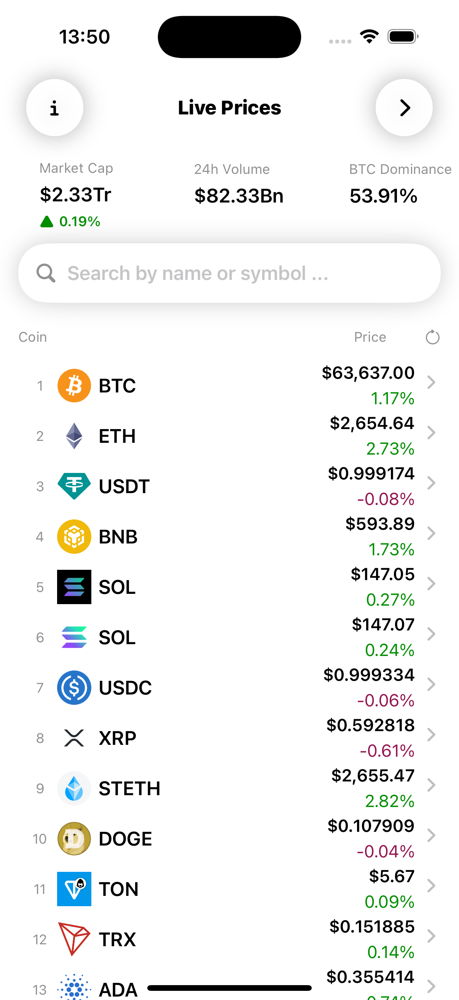
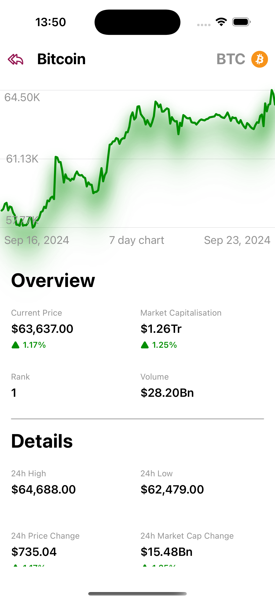
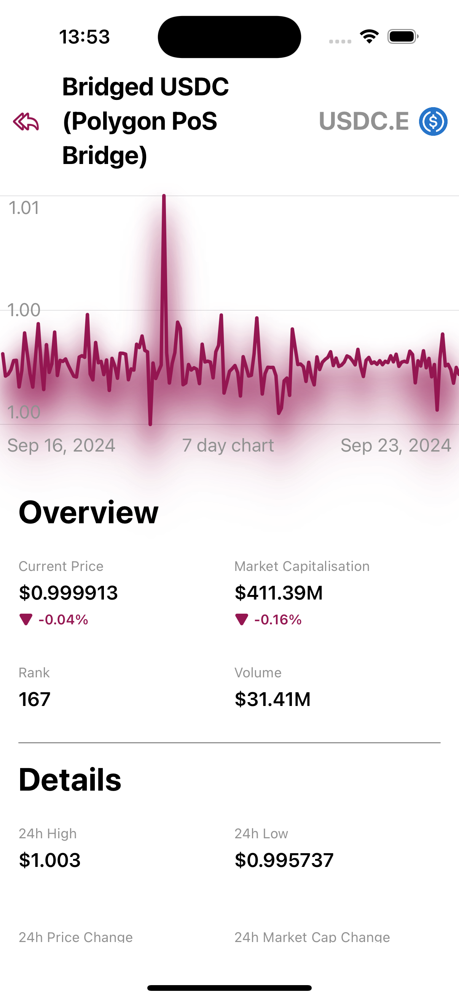
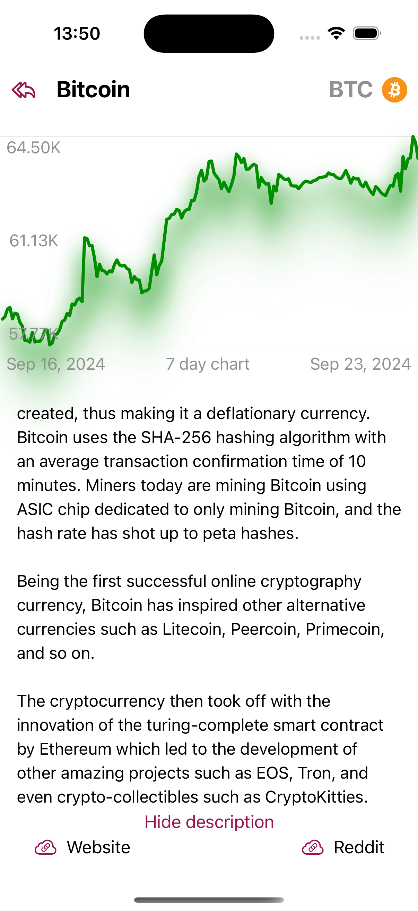
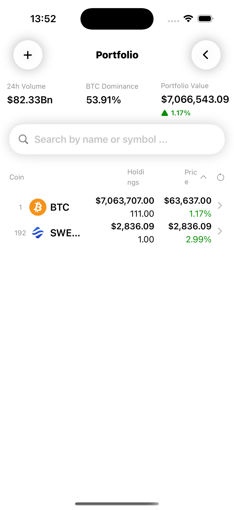
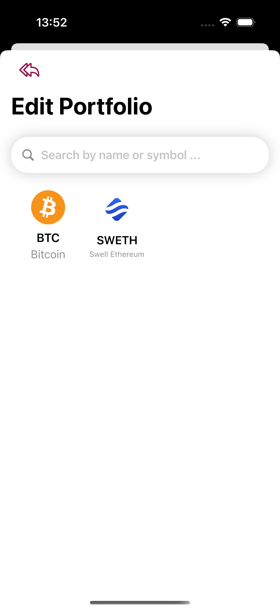

### Project: Crypto App

**Description:**
An crypto app that allows you to track the price of cryptocurrencies. The app uses the CoinGecko API to get the latest data on cryptocurrencies. The app allows you to search for coins and add them to your portfolio. The app also allows you to sort the coins by different criteria. The app also allows you to view the seven-day chart of the coin. The app also allows you to view the description of the coin.

**Key Features:**
1. Using the MVVM pattern
1. Includes UI and Unit Tests
1. Adapt to the dark and light mode
1. Sorting implemented from six options
1. Combined with Publishers and Subscribers
1. CoreData storage of previously uploaded images
1. Cryptocurrency tracking application.  
1. The app uses three free CoinGecko APIs. 
1. In the app you can search and track coins.
1. Add your favorites coins to the portfolio and save in memory.
1. For each coin there is a seven-day chart, as well as a description and other details.

**Technologies:**
1. SwiftUi
1. Combine
1. Core Data
1. UI Unit Tests
1. API CoinGecko

**Screenshots:**

